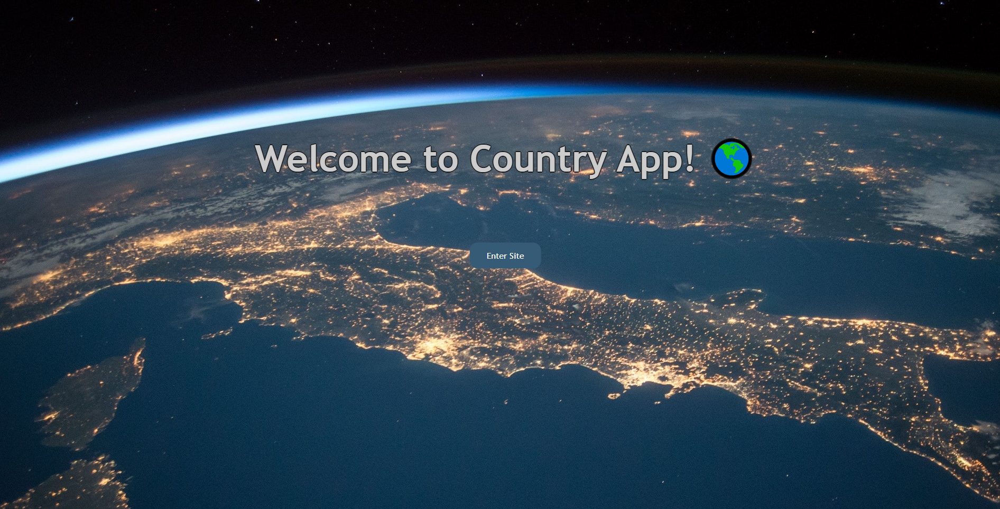

# Individual Project - Henry Countries

## Objetivos del Proyecto

- Construir una App utlizando React, Redux, Node y Sequelize.
- Afirmar y conectar los conceptos aprendidos en la carrera.
- Aprender mejores prácticas.
- Aprender y practicar el workflow de GIT.
- Usar y practicar testing.
## About

Hi!, I'm Camilo from Chile and this is my personal project for Henry bootcamp!. I made all parts of this website, the Back end with Node JS, Express JS and Sequelize, and the Front end with React JS, Redux and CSS.

    

    

    

    

    

    

    

